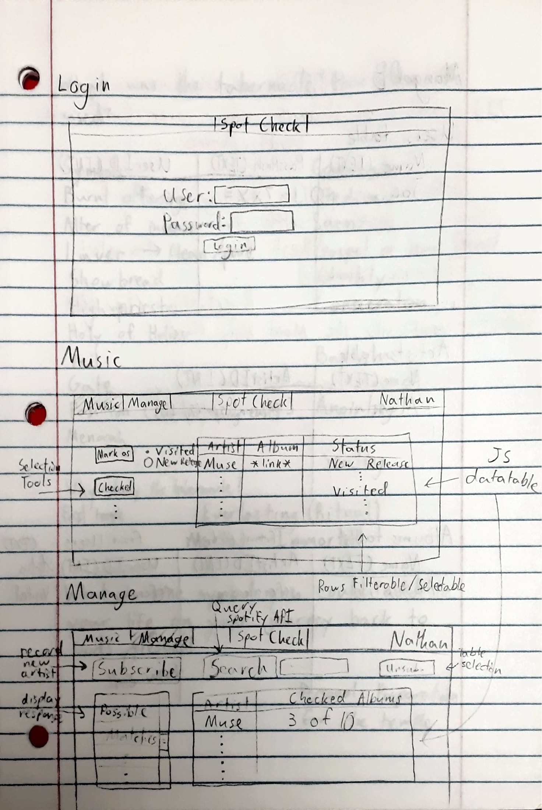
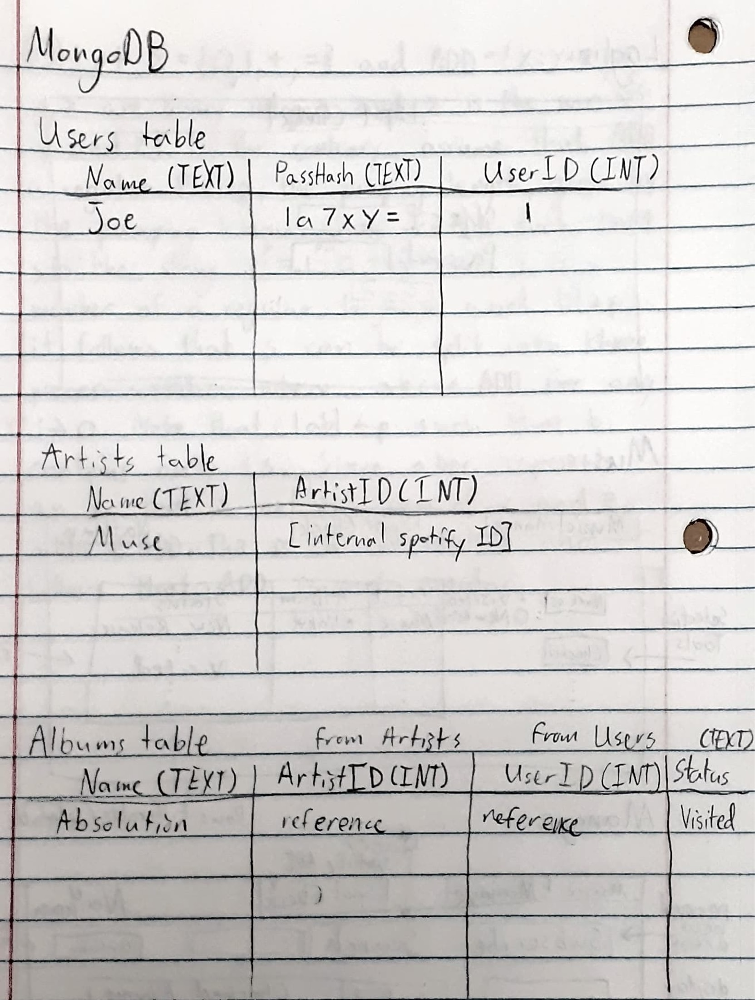

# Spot Check
Uses the Spotify API to track users' favorite Artists' new releases

## Specification

### Elevator Pitch
Love music? The Spot Check web application is a convenient way to keep
tabs on all of your favorite artists without constantly checking for new releases.
Subscribe to Spotify artists to get the latest updates and organize your music
discovery process. Be the first to know when new music becomes available!

### Design

The UI could be something like this:

A possible database scheme for storing users and music:

### Key Features

- [ ] Secure login over HTTPS
- [ ] Add/Remove artist subscriptions
- [ ] Periodically check for artist releases via the Spotify API
- [ ] View and organize new releases
- [ ] Persistant storage of user data
- [ ] REST API for retrieving a list of user songs
- [ ] Show application operations in real time

### Technologies

- **HTML** - Provide framework for 3 pages including **Login**, **Music**, **Manage**. Links between pages
- **CSS** - Style application for easy navigation and uniform feel
- **JavaScript** - Enable login button (any password allowed), add datatables with placeholder data
- **Service** - Connect to Spotify API and enable search functionality. Populate tables with artist data in memory
- **DB** - Build database schema and create functions for storing and retrieving data. Persistently store users, artists, and albums. At this point I could create a REST API for retrieving database entries
- **Login** - Check user input against stored users. Only allow *valid* passwords
- **WebSocket** - Push realtime alerts for new music. Possibly display server commands and asynchronous check progress
- **React** - Port web app to React framework

## HTML Deliverable

Built an HTML structure for the Spot Check web app

- **Pages** - Created three HTML pages for: login, viewing new music, and managing artist subscritions
- **Links** - Navigation between pages is included in each header
- **Text** - Text provided for tables and input labels
- **Services** - Placeholder artist search in Manage page's subscription select box
- **Images** - Created a favicon
- **Login** - Username and password inputs provided. Placeholder login button links to the music page
- **Database** - Each album and artist is represented textually with dummy data representing a database
- **WebSocket** - Placeholder text representing a log of real-time server activity. Showing notification of new albums as a superscript on the 'Music' link

## CSS Deliverable

Styled each page to provide responsive layout and modern design

- **Layout** - Pages have a uniform header, footer, and main content area
- **Navigation** - Split navigation pattern with the username on the right
- **Responsive** - Footer is hidden for short viewports and the controls are only displayed in an aside for wide viewports. Adapt to dark mode by changing --theme-bg
- **Application** - Represented tables as styled DataTables (selection is already enabled)
- **Text** - Loaded iosevka font to style text content. Placeholders are provided for interactive content
- **Images** - Displayed the logo as a superscript on the login page

## JavaScript Deliverable

Enabled buttons and interaction with table selection and stored user data locally stored

- **Login** - Support for login includes registering a new user, logging in with a registered username and password, displaying the logged-in username
- **Database** - Application data is stored in the browser's local storage and retrieved each time a page is loaded. There is not currently support for handling multiple users' data
- **Websocket** - Functionality for websocket data (notification of new albums and console log) is simulated with a timeout loop and randomly generated data
- **Application Logic** - Tables can be updated using the provided buttons. The selected row can be modified or hidden the Music page and rows can be added or removed on the manage page

## Service Deliverable

Created backend with authentication, in-memory data persistence and access to Spotify API

- **Login** - Bearer tokens are created to uniquely identify authenticated users
- **Static Files** - Webpages are served in express through middleware
- **Endpoints** - Backend API with endpoints /artists, /albums, /login, /search, /user for login and manipulating data
- **Frontend** - Buttons call backend API to expose functionality for finding artists, subscribing and marking visited and checked albums

## Database & Login Deliverables

- **Login** - Passwords are hashed and salted before storage in MongoDB Atlas. Registration and login endpoints are backed by persistent storage
- **Data Manipulation** - Backend support for importing new artsists and albums, updating user album status and user artist subscriptions
- **Data Persistence** - Artists and albums are stored globally, user subscriptions and album status are stored individually with id references to albums and artists

## Websocket Deliverable

- **Backend** - Listens for websocket connections and maintains a list of active clients
- **Frontend** - Connects to server endpoint
- **Data** - Once a day the sever will send the message "Executing SpotCheck" to all clients then query spotify for the artists' albums to notify clients of new releases
- **Display** - Clients see when the server checks for new updates and are notified of how many artists have released new albums since the last check

